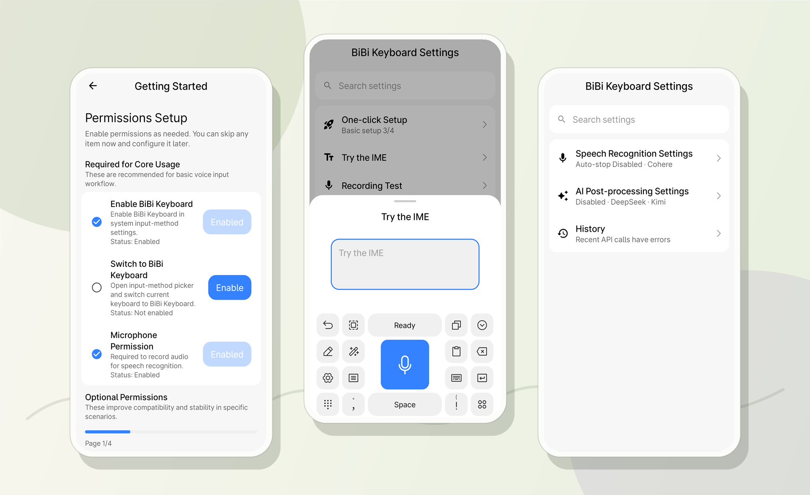
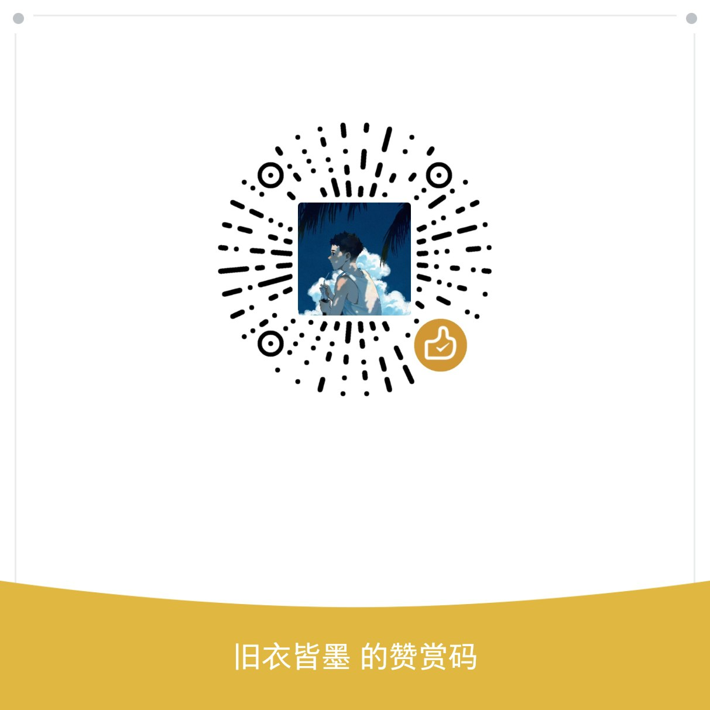

<div align="center">


# BiBi Keyboard

**AI-powered Smart Voice Input Method | Make Voice Input More Natural and Efficient**

### 🌐 [Official Website](https://bibi.brycewg.com) • 📖 [Documentation](https://bibidocs.brycewg.com/en/)

English | [简体中文](README.md)

[](https://opensource.org/licenses/Apache-2.0)
[](https://www.android.com/)
[](https://kotlinlang.org/)
[](https://t.me/+UGFobXqi2bYzMDFl)
[![zread](https://img.shields.io/badge/Ask_Zread-_.svg?style=flat&color=00b0aa&labelColor=000000&logo=data%3Aimage%2Fsvg%2Bxml%3Bbase64%2CPHN2ZyB3aWR0aD0iMTYiIGhlaWdodD0iMTYiIHZpZXdCb3g9IjAgMCAxNiAxNiIgZmlsbD0ibm9uZSIgeG1sbnM9Imh0dHA6Ly93d3cudzMub3JnLzIwMDAvc3ZnIj4KPHBhdGggZD0iTTQuOTYxNTYgMS42MDAxSDIuMjQxNTZDMS44ODgxIDEuNjAwMSAxLjYwMTU2IDEuODg2NjQgMS42MDE1NiAyLjI0MDFWNC45NjAxQzEuNjAxNTYgNS4zMTM1NiAxLjg4ODEgNS42MDAxIDIuMjQxNTYgNS42MDAxSDQuOTYxNTZDNS4zMTUwMiA1LjYwMDEgNS42MDE1NiA1LjMxMzU2IDUuNjAxNTYgNC45NjAxVjIuMjQwMUM1LjYwMTU2IDEuODg2NjQgNS4zMTUwMiAxLjYwMDEgNC45NjE1NiAxLjYwMDFaIiBmaWxsPSIjZmZmIi8%2BCjxwYXRoIGQ9Ik00Ljk2MTU2IDEwLjM5OTlIMi4yNDE1NkMxLjg4ODEgMTAuMzk5OSAxLjYwMTU2IDEwLjY4NjQgMS42MDE1NiAxMS4wMzk5VjEzLjc1OTlDMS42MDE1NiAxNC4xMTM0IDEuODg4MSAxNC4zOTk5IDIuMjQxNTYgMTQuMzk5OUg0Ljk2MTU2QzUuMzE1MDIgMTQuMzk5OSA1LjYwMTU2IDE0LjExMzQgNS42MDE1NiAxMy43NTk5VjExLjAzOTlDNS42MDE1NiAxMC42ODY0IDUuMzE1MDIgMTAuMzk5OSA0Ljk2MTU2IDEwLjM5OTlaIiBmaWxsPSIjZmZmIi8%2BCjxwYXRoIGQ9Ik0xMy43NTg0IDEuNjAwMUgxMS4wMzg0QzEwLjY4NSAxLjYwMDEgMTAuMzk4NCAxLjg4NjY0IDEwLjM5ODQgMi4yNDAxVjQuOTYwMUMxMC4zOTg0IDUuMzEzNTYgMTAuNjg1IDUuNjAwMSAxMS4wMzg0IDUuNjAwMUgxMy43NTg0QzE0LjExMTkgNS42MDAxIDE0LjM5ODQgNS4zMTM1NiAxNC4zOTg0IDQuOTYwMVYyLjI0MDFDMTQuMzk4NCAxLjg4NjY0IDE0LjExMTkgMS42MDAxIDEzLjc1ODQgMS42MDAxWiIgZmlsbD0iI2ZmZiIvPgo8cGF0aCBkPSJNNCAxMkwxMiA0TDQgMTJaIiBmaWxsPSIjZmZmIi8%2BCjxwYXRoIGQ9Ik00IDEyTDEyIDQiIHN0cm9rZT0iI2ZmZiIgc3Ryb2tlLXdpZHRoPSIxLjUiIHN0cm9rZS1saW5lY2FwPSJyb3VuZCIvPgo8L3N2Zz4K&logoColor=ffffff)](https://zread.ai/BryceWG/BiBi-Keyboard)
[](https://deepwiki.com/BryceWG/BiBi-Keyboard)


[Features](#-features) • [UI Showcase](#-ui-showcase) • [Quick Start](#-quick-start)

</div>

## 📱 UI Showcase

<div align="center">

</div>

<table>
<tr>
<td width="33%" align="center"><b>Easy Setup</b><br/><sub>Step-by-step guidance for IME and permission setup</sub></td>
<td width="34%" align="center"><b>Voice-first Typing</b><br/><sub>Open the keyboard and hold the microphone to speak</sub></td>
<td width="33%" align="center"><b>Smart Enhancements</b><br/><sub>Manage recognition, AI post-processing, and history</sub></td>
</tr>
</table>

## ✨ Features

<table>
<tr>
<td width="50%">

### 🎤 Voice Recognition

- **Press & Hold Recording** - Simple and intuitive recording
- **Smart Auto-Stop** - Automatically stops recording on silence
- **Fast Recognition** - Release to upload, quick results
- **Multi-Engine Support** - 18 ASR vendors (12 cloud + 6 local)
- **Local ASR Models** - SenseVoice / FunASR Nano / Qwen3-ASR / Parakeet / FireRedASR / X-ASR for offline use
- **Primary + Backup** - Backup engines and local backup residency for unstable networks
- **AI Text Optimization** - LLM post-processing; history can cache audio and re-run recognition/post-processing

</td>
<td width="50%">

### 🟣 Floating Ball Input ⭐

- **Cross-IME Usage** - Voice input with any input method
- **Hold to Record** - Press and hold to record, release to stop
- **Seamless Integration** - Maintain your original typing habits
- **Auto Insertion** - Recognition results automatically inserted
- **Compatibility Mode** - Support for Telegram, TikTok and other special apps
- **Visual Feedback** - Recording/processing status at a glance

</td>
</tr>
<tr>
<td width="50%">

### 📝 Smart Input

- **AI Edit Panel** - Dedicated editing interface with voice command text editing
- **Custom Keyboard Layout** - Freely rearrange key pools and panels
- **Clipboard Sync & History** - SyncClipboard upload/pull plus in-app clipboard history
- **IME Bridge** - Record, commit text, and sync clipboard in third-party IMEs via LSPosed/LSPatch module
- **Fcitx5/Trime Integration** - Invoke BiBi recognition from modified Fcitx5-Android/Trime
- **External Speech Input Interface** - Third-party apps via SpeechRecognizer / AIDL [Open-source Test Tool](https://github.com/BryceWG/SpeechRecognizer-Tester)

</td>
<td width="50%">

### 🎨 User Experience

- **Material3 / Miuix** - Modern settings UI with Monet and Miuix styles
- **Multi-language Support** - Simplified Chinese, Traditional Chinese, English, Japanese, and Arabic
- **Keyboard Height Adjustment** - Three height levels to choose from
- **Auto Enter After ASR** - Optionally send automatically after recognition in chat apps
- **Backup & Restore** - One-tap export/import of settings
- **Vibration Feedback** - Microphone / keyboard button vibration
- **Auto Update Check** - Daily automatic update check on app launch

</td>
</tr>
</table>

## 🌟 Pro Version Released

> 💎 **BiBi Keyboard Pro** is now officially available on the Play Store for a one-time purchase of just $5.49!

The Pro version offers more advanced features and a better experience (hotwords, Simplified/Traditional conversion, continuous dictation, WebDAV auto-backup, and more).
You can learn more in **About → Learn about Pro**, or in the [Pro Features](https://bibidocs.brycewg.com/en/pro/features.html) documentation. We welcome your feedback to help us polish a better product!

If you are interested in BiBi Keyboard, join our [Telegram Group](https://t.me/+UGFobXqi2bYzMDFl) for more information.

## 🚀 Quick Start

[Provider Configuration Guide](https://brycewg.notion.site/bibi-keyboard-providers-guide)

### 📋 System Requirements

- Android 8.0 (API 26) or higher
- Microphone permission (for voice recognition)
- Overlay permission (optional, for floating ball feature)
- Accessibility permission (optional, for automatic text insertion)
- LSPosed / LSPatch (optional, for integration with any third-party IMEs)

### 📥 Installation Steps

1. **Download & Install**
   - Download the latest APK from [Releases](../../releases) page
   - Install on your Android device

2. **Enable Input Method**

   ```
   Settings → System → Language & Input → Virtual Keyboard → Manage Keyboards → Enable "BiBi Keyboard"
   ```

3. **Configure ASR Service**
   - Open BiBi Keyboard settings
   - Select ASR vendor (recommended: Volcengine)
   - Enter your API key

4. **Start Using**
   - Switch to BiBi Keyboard in any input field
   - Long press the microphone button to start voice input

> 💡 **Tip**: First-time users are recommended to configure Volcengine for 20 hours of free quota!

### 🎨 Tech Stack

```
Kotlin 2.3.21
Android SDK (Compile SDK 37, Target SDK 35, Min SDK 26)
Jetpack Compose + Material Design 3 / Miuix
Coroutines (async processing)
OkHttp 5.3.2 (network requests)
SharedPreferences (data storage)
sherpa-onnx (local ASR models)
```

## 📄 License

This project is licensed under the **Apache 2.0 License**, see the [LICENSE](LICENSE) file for details.

```
Apache 2.0 License - Free to use, modify, distribute, must retain copyright notice
```

## Star History

<a href="https://www.star-history.com/?type=date&legend=top-left&repos=BryceWG%2FBiBi-Keyboard">
 <picture>
   <source media="(prefers-color-scheme: dark)" srcset="https://api.star-history.com/chart?repos=BryceWG/BiBi-Keyboard&type=date&theme=dark&legend=top-left&sealed_token=Qzk3vW5gzhrFU38x3S-wQ2YRnP03Q4pKh5p4GSqlL0Y9Lq2CX8eCvAK8C_-K08ofqKJV5xmmXgEIzM48LKBX8Ptp41I_7sKYlE33OcG_bFxIit_u3jIvtw" />
   <source media="(prefers-color-scheme: light)" srcset="https://api.star-history.com/chart?repos=BryceWG/BiBi-Keyboard&type=date&legend=top-left&sealed_token=Qzk3vW5gzhrFU38x3S-wQ2YRnP03Q4pKh5p4GSqlL0Y9Lq2CX8eCvAK8C_-K08ofqKJV5xmmXgEIzM48LKBX8Ptp41I_7sKYlE33OcG_bFxIit_u3jIvtw" />
   
 </picture>
</a>

## ☕ Support & Appreciation

If this project helps you, please give it a Star ⭐️ and feel free to buy me a coffee ☕️

<div align="center">

<br/>
<sub>Scan with WeChat to appreciate</sub>
</div>

---

## 🙏 Acknowledgments

Thanks to the following open-source projects for their technical support:

- [sherpa-onnx](https://github.com/k2-fsa/sherpa-onnx) - Provides technical support for local ASR models, making offline voice recognition possible
- [TEN-VAD](https://github.com/TEN-framework/ten-vad) - Provides the current VAD model support
- [SyncClipboard](https://github.com/Jeric-X/SyncClipboard) - Provides clipboard synchronization backend service (not running locally, requires server)
- [Phosphor](https://github.com/phosphor-icons/homepage) - Provides almost all icons used in the software
- [miuix](https://github.com/compose-miuix-ui/miuix) - Provides Miuix-style Compose UI components, icons, and preference components
- [WaveLineView](https://github.com/Jay-Goo/WaveLineView) - Provides beautiful wave animation implementation for audio visualization, making recording experience more fluid and visually appealing
- Thanks to the author NURKE(南㲺) of the "Completion Project" icon pack for designing the new application icon for this project

<div align="center">

**Made with ❤️ by BryceWG**

</div>
